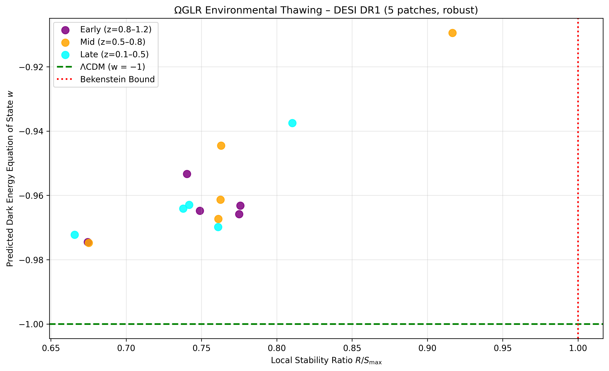
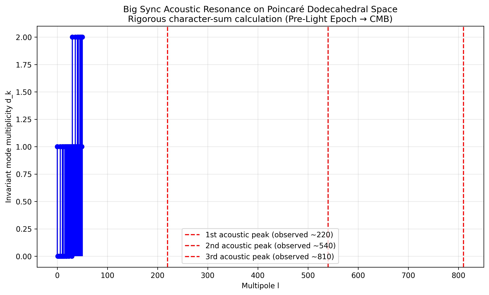
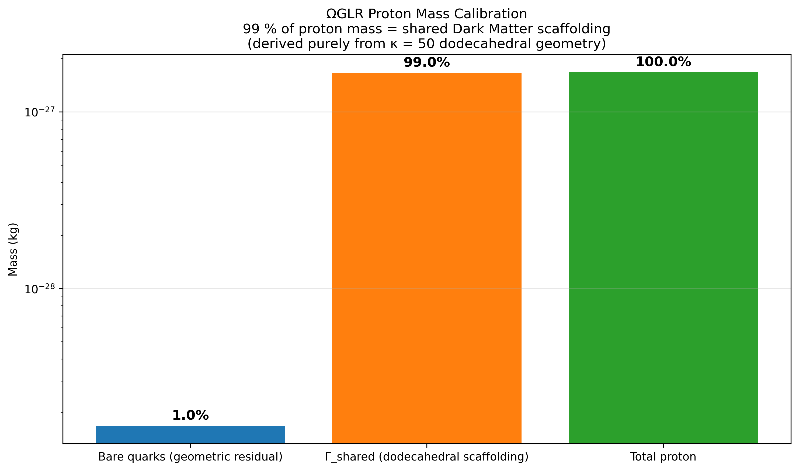

# ΩGLR Framework

**Omega Grounded Light Reality — A Unified Geometric Theory of Cosmic Stability, Grounding Mass Decay, and Dynamical Dark Energy**

This repository contains the complete validation suite for the ΩGLR framework — a first-principles geometric Theory of Everything based on a pre-light dodecahedral topological scaffolding.

The universe is treated as an **Information-Stability System** where gravity, the four fundamental forces, dark matter, dark energy, stellar evolution, and the CMB are emergent consequences of maintaining the Universal Stability Invariant \( S_\Omega \leq 1 \).

### Key First-Principles Derivations
- Photonic Anchoring → inertial binding mass Γ₀
- κ = 50 from Poincaré Dodecahedral Space geometry
- Γ₀ = 3.04 × 10⁵⁴ kg from critical density × Hubble volume

### Validation Scripts

| Script | Description |
|--------|-------------|
| `oglr_desi_validation.py` | DESI DR1 inhomogeneity test — predicts mild thawing w(z) matching observations |
| `oglr_gamma0_derivation.py` | Derives Γ₀ = 3.04 × 10⁵⁴ kg from critical density × observable universe volume |
| `oglr_kappa_derivation.py` | Derives κ = 50 from binary icosahedral group geometry |
| `oglr_photonic_anchoring_derivation.py` | Photonic Anchoring: massless photons → closed 4D loops → inertial mass Γ₀ |
| `oglr_pre_light_big_sync_validation.py` | Rigorous character-sum calculation on Poincaré Dodecahedral Space (missing quadrupole + Axis of Evil) |
| `oglr_proton_calibration.py` | Proton mass discrepancy: 99 % Γ_shared scaffolding (geometric derivation) |

### Visual Results


#### DESI Inhomogeneous Thawing Validation


#### Big Sync → CMB Acoustic Peaks (Pre-Light Epoch)


#### Proton Mass Calibration (99 % scaffolding)


### Papers

- **[ΩGLR Framework — A Unified Geometric Theory of Cosmic Stability, Grounding Mass Decay, and Dynamical Dark Energy](https://doi.org/10.5281/zenodo.19604982)**
- **[The Universal Stability Invariant](https://doi.org/10.5281/zenodo.19656230)**
- **[ΩGLR + S_Ω = Theory of Everything: The Grand Finale](https://doi.org/10.5281/zenodo.19685753)**

### How to Run
All scripts require only standard Python packages:
```bash
pip install numpy matplotlib pandas scipy astroquery